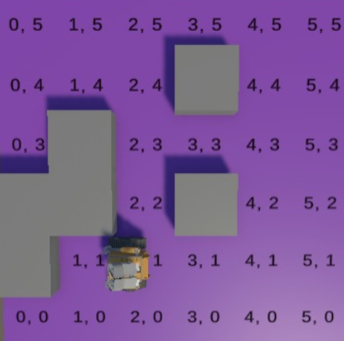

# Inteligent Agents

##### Dexterous Manipulation using Processing IDE and Python. 

  

This repository contains the implementation of intelligent agents using Python with the MESA framework for multi-agent simulations. The agents are visualized in Unity, allowing for interactive and real-time analysis of their behaviors. The project explores different types of agents with distinct decision-making mechanisms.

Implemented Agents

- Reactive Agent: Moves randomly until encountering an obstacle, at which point it changes direction.
- A* (A-star): Uses pathfinding to find the most efficient route to the goal, avoiding obstacles optimally.
- Bayesian Agent: Makes probabilistic decisions based on learned data about the environment.
- Q-Learning Agent: Uses reinforcement learning to explore and optimize its movement over time

